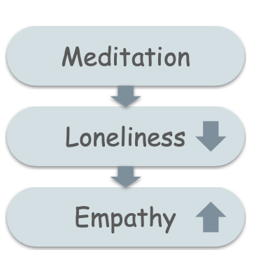
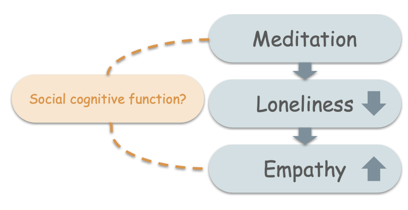
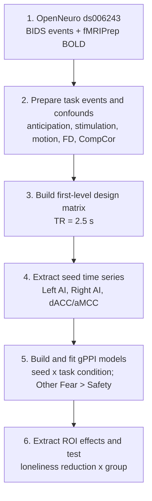
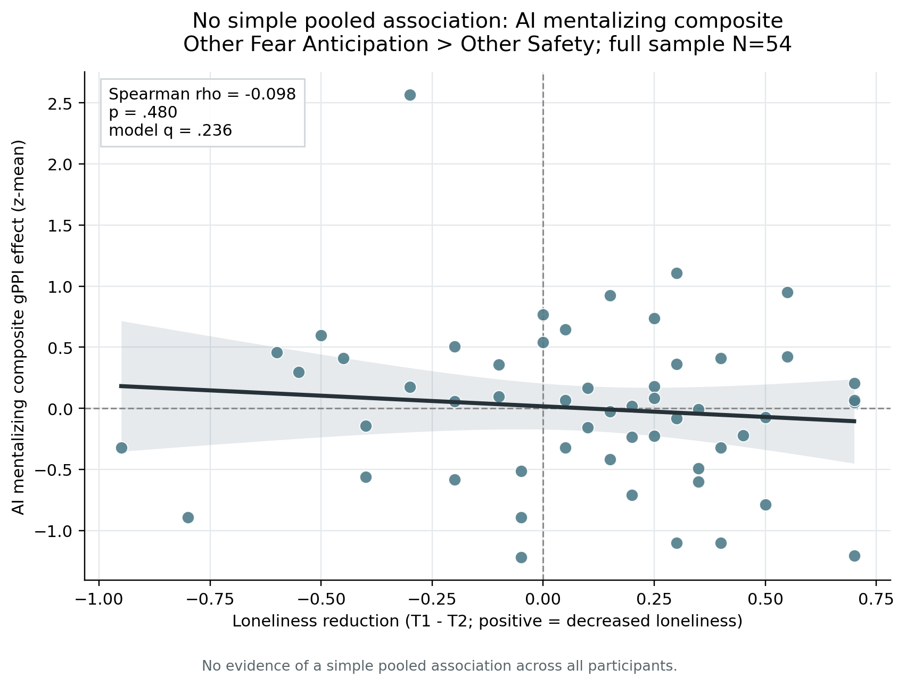
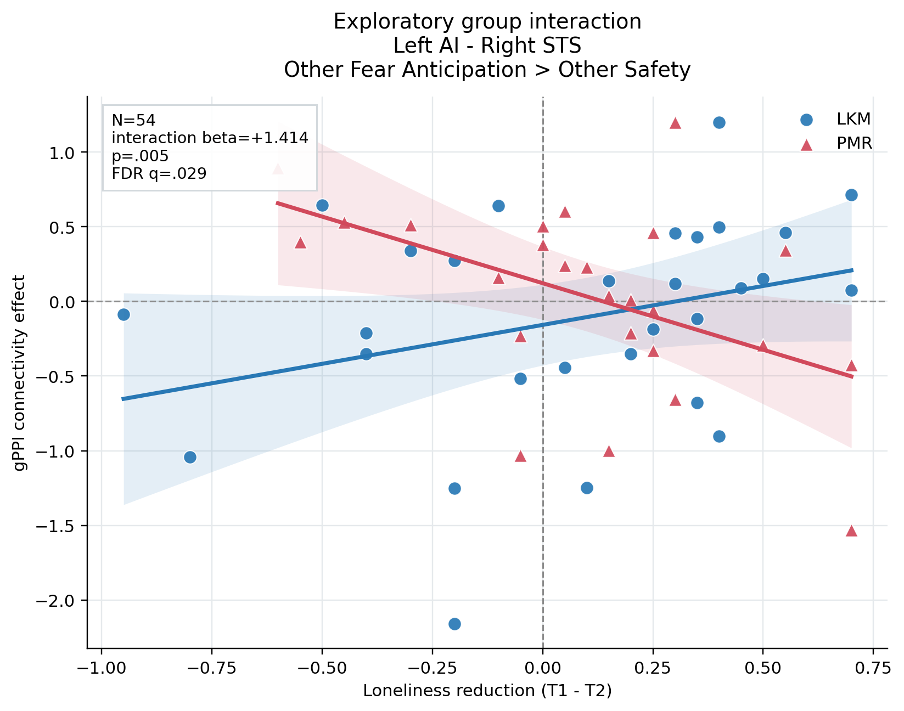
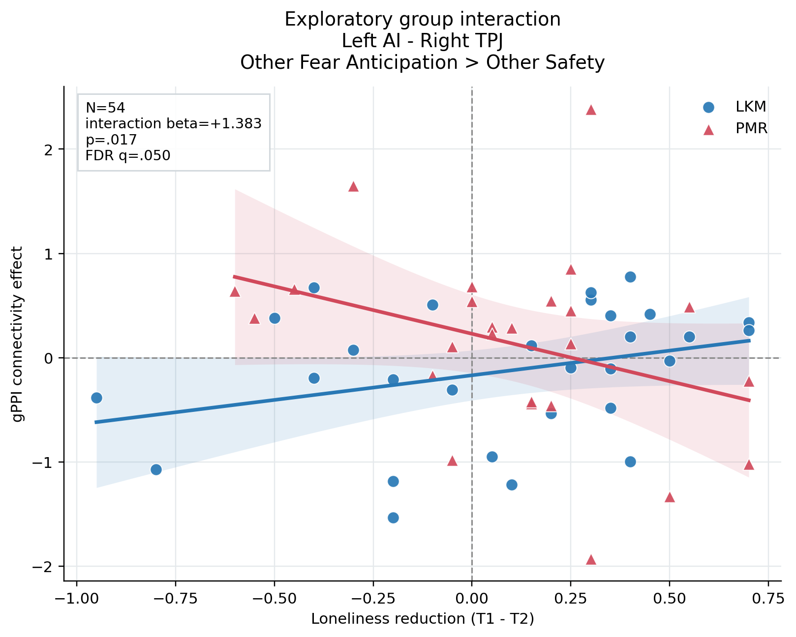
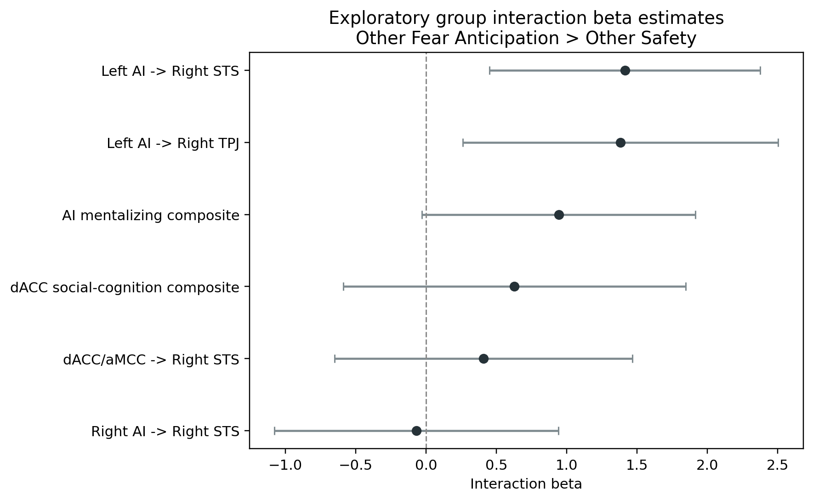

# Brain Connectivity During Observed Fear Anticipation and Loneliness Reduction After Meditation Training

> **Can another researcher reproduce this fMRI analysis without asking for hidden scripts or undocumented preprocessing decisions?**

A reproducible gPPI reanalysis of OpenNeuro `ds006243` comparing
Loving-Kindness Meditation (LKM) and Progressive Muscle Relaxation (PMR).

**Quick navigation:** [Background](#background) |
[Research question](#research-question) |
[Pipeline](#six-step-analysis-pipeline) |
[Pooled result](#1-no-simple-pooled-relationship-in-the-full-sample) |
[Group interaction results](#2-why-test-a-group-interaction) |
[Caveats](#6-exploratory-caveat)

## Background

One possible way to reduce loneliness is meditation. In particular,
loving-kindness meditation, or LKM, is designed to increase warm and positive
feelings toward oneself and others.



Loneliness may be related not only to how strongly individual brain regions
respond to social information, but also to how affective-empathy and
social-cognitive systems communicate during anticipation of another person's
pain.

The dataset contains an empathic-pain task collected after LKM or PMR
training. This project asks whether reductions in loneliness are related to
task-dependent functional connectivity, and whether that relationship differs
between the two training groups.

## Original Paper vs This Reanalysis

| Original study | This reanalysis |
| --- | --- |
| Self-other multi-voxel pattern similarity | Task-dependent functional connectivity |
| Are self and other neural patterns similar? | Do affective-empathy and social-cognitive regions communicate differently? |
| AI and dACC local pattern representation | AI/dACC-seeded connectivity with TPJ, STS, mPFC, and PCC |
| Loneliness and pattern similarity | Loneliness reduction x meditation group interaction |

## Research Question



> **Does reduced loneliness follow one shared neural relationship across
> everyone, or does the connectivity-loneliness relationship differ between
> LKM and PMR?**

The primary public contrast is **Other Fear Anticipation > Other Safety**.
Loneliness reduction is defined as `T1 - T2`, so positive values indicate
decreased loneliness after training.

## Six-Step Analysis Pipeline



The final inferential step tests whether the relationship between loneliness
reduction and connectivity differs between LKM and PMR in the full sample.

gPPI estimates task-dependent functional connectivity. “Left AI-seeded
connectivity with Right STS” describes the seed used to estimate connectivity;
it does not imply causal influence.

**No raw BOLD data, NIfTI maps, masks, or participant-level derivatives are
committed to this repository.**

## Results

The public results first examine whether loneliness reduction is related to a
simple pooled connectivity measure across all 54 participants. We then test
whether this relationship differs between LKM and PMR.

- **Full sample:** N = 54
- **LKM:** 29
- **PMR:** 25
- **Contrast:** Other Fear Anticipation > Other Safety
- **Status:** All reported findings are exploratory.

### 1. No Simple Pooled Relationship in the Full Sample



Across all 54 participants, loneliness reduction was not associated with the
AI mentalizing composite:

- **Spearman rho:** -0.098
- **p:** .480
- **Model q:** .236

This suggests that a single pooled brain-behavior relationship may not
adequately describe both meditation groups. **This null pooled association
does not mean the groups have identical relationships.**

### 2. Why Test a Group Interaction?

> **If LKM and PMR show opposite brain-behavior slopes, pooling them may hide
> both patterns.**

```text
gPPI connectivity ~ loneliness reduction x group
```

- **gPPI connectivity:** task-dependent connectivity during **Other Fear
  Anticipation > Other Safety**.
- **Loneliness reduction:** `T1 - T2`; positive values indicate decreased
  loneliness.
- **Group:** LKM versus PMR.
- **Interaction:** tests whether the loneliness-connectivity slopes differ
  between the two groups.

We are not asking whether LKM had higher connectivity on average. We are
asking whether the connectivity-loneliness relationship had different slopes
in LKM and PMR.

### 3. Full-Sample Group Interaction: Left AI-Seeded Right STS Connectivity



*Full-sample group interaction model, N = 54. LKM and PMR are shown separately
only to visualize the interaction.*

- **Interaction beta:** +1.414
- **p:** .005
- **FDR q:** .029
- **Contrast:** Other Fear Anticipation > Other Safety

The interaction was significant after FDR correction. This indicates that the
association between loneliness reduction and Left AI-seeded Right STS
connectivity differed between LKM and PMR.

In the fitted model, the LKM slope was positive and the PMR slope was negative.
These separate lines explain the interaction; the inferential test is the
full-sample interaction term. **LKM and PMR showed different fitted slopes.**

### 4. Full-Sample Group Interaction: Left AI-Seeded Right TPJ Connectivity



- **Interaction beta:** +1.383
- **p:** .017
- **FDR q:** .050
- **Label:** FDR-threshold exploratory finding

A similar group-dependent slope pattern was observed for Left AI-seeded Right
TPJ connectivity. Because the FDR q value was at the .05 threshold, this
result should be interpreted cautiously.

### 5. Summary Across Tested Pathways



The forest plot summarizes candidate group interaction effects. The strongest
positive interaction estimates were observed for Left AI-seeded connectivity
with Right STS and Right TPJ. Other pathways had confidence intervals
overlapping zero.

### 6. Exploratory Caveat

> **These findings are FDR-corrected within the tested interaction family, but
> they remain exploratory because the highlighted ROI pairs were prioritized
> after preliminary inspection of the same dataset. They are
> hypothesis-generating and require preregistered or independent replication.**

## Discussion Prompt

> **If the pooled relationship is near zero but the group interaction is
> nonzero, what should the next preregistered study test?**
