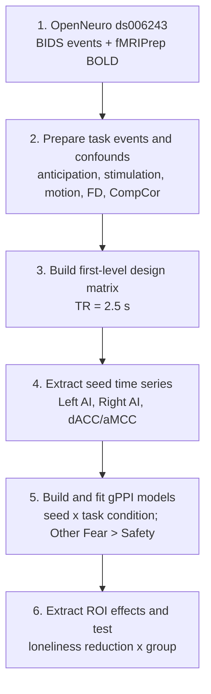
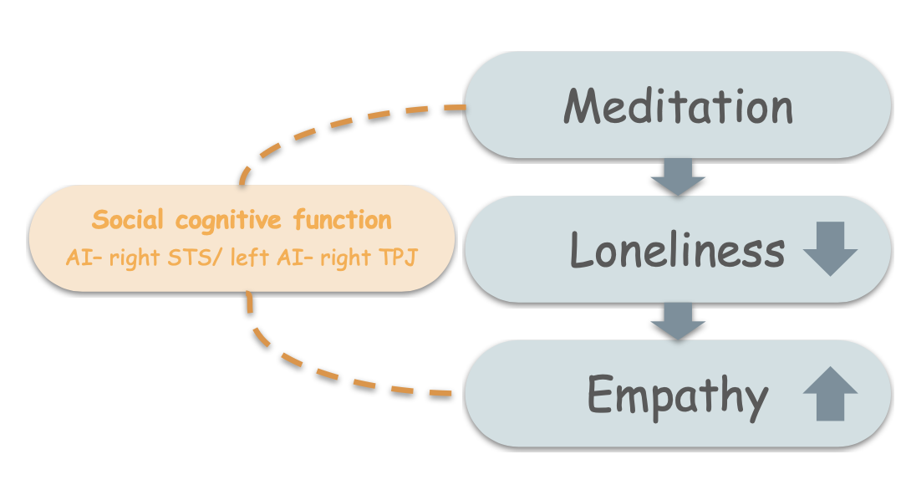

# Brain Connectivity During Observed Fear Anticipation and Loneliness Reduction After Meditation Training

> **Do you feel lonely? When loneliness decreases, do people simply feel
> better—or does their brain become better at connecting with other people?**

A reanalysis of
[OpenNeuro ds006243](https://openneuro.org/datasets/ds006243/versions/1.1.2)
examining whether loneliness reduction is related to task-dependent
connectivity.

## Background

One possible way to reduce loneliness is meditation. In particular,
loving-kindness meditation (LKM), is designed to increase warm and positive
feelings toward oneself and others. But progressive muscle relaxation (PMR) is control group.


Loneliness may be related not only to how strongly individual brain regions
respond to social information, but also to how affective-empathy and
social-cognitive systems communicate during anticipation of another person's
pain.
We use fMRI connectivity analysis to ask whether reduced loneliness is related to better communication between brain systems for empathy and social understanding.

## Original Paper vs This Reanalysis

| Original study | This reanalysis |
| --- | --- |
| Self-other multi-voxel pattern similarity | Task-dependent functional connectivity |
| Are self and other neural patterns similar? | Do affective-empathy and social-cognitive regions communicate differently? |
| AI and dACC local pattern representation | AI/dACC-seeded connectivity with TPJ, STS, mPFC, and PCC |
| Loneliness and pattern similarity | Loneliness reduction x meditation group interaction |

## Hypothesis


Loneliness reduction may involve communication between affective-empathy and social-cognitive brain networks.


## Six-Step Analysis Pipeline



The primary public contrast is **Other Fear Anticipation > Other Safety**.
Loneliness reduction is defined as `T1 - T2`, so positive values indicate
decreased loneliness after training.

The final inferential step tests whether the relationship between loneliness
reduction and connectivity differs between LKM and PMR in the full sample.

gPPI estimates task-dependent functional connectivity. “Left AI-seeded
connectivity with Right STS” describes the seed used to estimate connectivity;
it does not imply causal influence.

## Results

The public results first examine whether loneliness reduction is related to a
simple pooled connectivity measure across all 54 participants. We then test
whether this relationship differs between LKM and PMR.

- **Full sample:** N = 54
- **LKM:** n = 29
- **PMR:** n = 25
- **Contrast:** Other Fear Anticipation > Other Safety
- **Status:** All reported findings are exploratory.

### 1. No Simple Pooled Relationship in the Full Sample


Across all 54 participants, loneliness reduction was not associated with the
AI mentalizing composite:

- **Spearman rho:** -0.098
- **p:** .480
- **Model q:** .236

This suggests that a single pooled brain-behavior relationship may not
adequately describe both meditation groups. This pooled null result motivates
testing whether the two meditation groups show different brain-behavior
slopes.

### 2. Why Test a Group Interaction?

> **If LKM and PMR show opposite brain-behavior slopes, pooling them may hide
> both patterns.**

```text
gPPI connectivity ~ loneliness reduction x group
```

- **gPPI connectivity:** task-dependent connectivity during **Other Fear
  Anticipation > Other Safety**.
- **Loneliness reduction:** `T1 - T2`; positive values indicate decreased
  loneliness.
- **Group:** LKM versus PMR.
- **Interaction:** tests whether the loneliness-connectivity slopes differ
  between groups.

We are not asking whether LKM had higher connectivity on average. We are
asking whether the connectivity-loneliness relationship had different slopes
in LKM and PMR.

### 3. Which Pathways Show the Strongest Group-Dependent Slopes?

Before interpreting individual scatter plots, we first examined the full set
of tested ROI pathways. The forest plot summarizes the estimated group
interaction effect for each pathway. Positive values indicate that the
loneliness reduction-connectivity slope was relatively more positive in LKM
than in PMR; confidence intervals crossing zero indicate no clear evidence of
a group slope difference.


The strongest positive interaction estimates were concentrated in Left
AI-seeded connectivity with Right Superior Temporal Sulcus （STS） and Right Temporoparietal Junction (TPJ). Other tested pathways had
confidence intervals overlapping zero.

### 4. Main Exploratory Pathway: Left AI-Seeded Right STS Connectivity

The forest plot identified Left AI-seeded Right STS connectivity as the
strongest positive group interaction estimate.


The FDR-corrected interaction indicates that the relationship between
loneliness reduction and Left AI-seeded Right STS connectivity differed
between LKM and PMR.

In the fitted full-sample model, the LKM line was positive and the PMR line was
negative. These lines visualize the interaction; the statistical test is the
interaction term, not separate within-group correlations.

### 5. Related Exploratory Pathway: Left AI-Seeded Right TPJ Connectivity


Left AI-seeded Right TPJ connectivity showed a similar positive group
interaction estimate. Because the FDR q value was at the .05 threshold, this
finding should be interpreted cautiously.

Together, Right STS and Right TPJ suggest that the candidate effects were
concentrated in right-lateralized social-cognitive targets, rather than
reflecting a general increase across all tested pathways.

## Conclusion



Reduced loneliness after LKM may involve more specific communication
   between affective empathy and social-cognitive systems in Left AI-Right STS and Left AI-Right STS .
