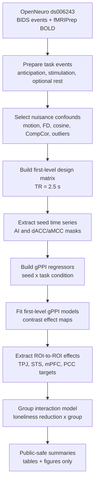
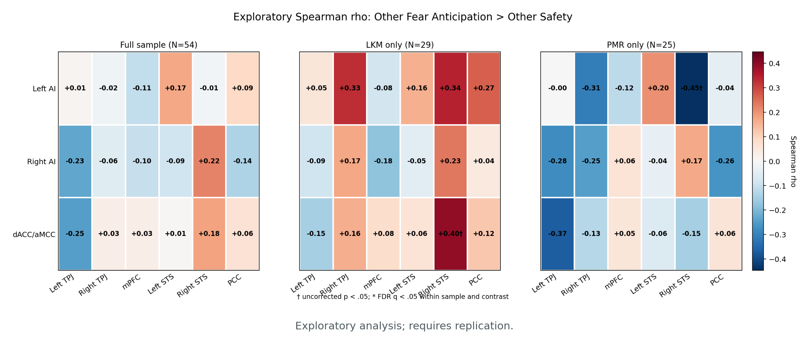

# Brain Connectivity During Observed Fear Anticipation and Loneliness Reduction After Meditation Training

This repository contains a public, reproducible gPPI reanalysis pipeline for
OpenNeuro `ds006243`, an fMRI empathic-pain task dataset collected after
loving-kindness meditation (LKM) or progressive muscle relaxation (PMR)
training.

## Background

Loneliness is not only a social experience; it is also linked to how people
process social threat, safety, and other people's distress. Meditation-based
training may change how affective-empathy systems communicate with
social-cognitive networks during social perception.

The original ds006243 study focused on self-other multi-voxel pattern
similarity during pain and fearful anticipation. This reanalysis asks a
different question: whether individual changes in loneliness are related to
task-dependent functional connectivity during an empathic-pain task.

## Gap

Previous analyses tell us whether brain activity patterns during self and other
conditions are similar. They do not directly test whether reductions in
loneliness are associated with stronger or weaker coupling between:

- affective-empathy regions, including anterior insula and dACC/aMCC
- social-cognitive regions, including TPJ, STS, mPFC, and PCC

This connectivity question matters because loneliness reduction may depend not
only on local activity in one region, but on communication between networks that
support affective sharing, anticipation, and social interpretation.

## Research Question

After training, is reduced loneliness associated with task-dependent brain
connectivity while participants anticipate or observe another person's pain?

The current public results focus on:

```text
Other Fear Anticipation > Other Safety
N = 54, LKM = 29, PMR = 25
```

The key exploratory model asks whether the loneliness-connectivity association
differs between LKM and PMR:

```text
gPPI connectivity effect ~ loneliness reduction * group
```

Loneliness reduction is defined as `T1 - T2`, so positive values indicate
decreased loneliness after training.

## Hypotheses

1. Greater loneliness reduction will be associated with altered
   task-dependent connectivity between affective-empathy seeds and
   social-cognitive target regions.
2. The association between loneliness reduction and connectivity may differ
   between LKM and PMR.
3. AI-to-TPJ/STS connectivity during anticipation of another person's pain is a
   candidate pathway linking affective-empathy processing with social-cognitive
   interpretation.

These hypotheses are treated as exploratory for the current public results
because the ROI pairs were inspected after preliminary analyses.

## Method



The analysis estimates generalized psychophysiological interaction (gPPI)
effects. A label such as `Left AI -> Right STS` means Left-AI-seeded
task-dependent connectivity with a Right STS target ROI. It does not imply
causal direction.

## Results

The public results package reports exploratory full-sample group-interaction
analyses. No raw data, subject-level fMRI maps, BOLD time series, masks, NIfTI,
GIFTI, CIFTI, or large derivatives are included.

Important caveat: these results are exploratory and post hoc. They do not
establish causality and require replication in an independent or preregistered
analysis.

### Left AI - Right STS


This was the strongest exploratory interaction. Greater loneliness reduction
was associated with stronger Left AI-seeded Right STS connectivity in LKM and
weaker connectivity in PMR.

```text
interaction beta = +1.414
p = .005
FDR q = .029
```

### Left AI - Right TPJ


This plot shows a similar exploratory interaction for Left AI-seeded Right TPJ
connectivity.

```text
interaction beta = +1.383
p = .017
FDR q = .050
```

### Interaction Summary


The forest plot compares interaction beta estimates across the selected ROI
pairs and network composites. Positive values indicate a more positive
LKM-vs-PMR difference in the loneliness-connectivity slope.

### Exploratory Heatmap



The heatmap summarizes exploratory associations between loneliness reduction
and gPPI effects across seed-target pairs for the Other Fear Anticipation >
Other Safety contrast. It is useful for pattern inspection, not confirmatory
inference.

See [results/README.md](results/README.md) for public-safe result tables and
additional interpretation notes.

## Discussion

The exploratory findings suggest that loneliness reduction may be related to
how affective-empathy regions communicate with social-cognitive regions during
anticipation of another person's pain. In the reported interaction models,
greater loneliness reduction corresponded to stronger Left AI-Right STS/TPJ
connectivity in LKM, but weaker connectivity in PMR.

This pattern is consistent with the idea that LKM may engage communication
between affective-empathy and social-cognitive systems. However, the current
results should be interpreted as hypothesis-generating because ROI pairs were
selected after preliminary inspection. They should not be presented as
confirmatory evidence until tested in a preregistered or independent analysis.

## Data Safety

Download the fMRI dataset separately from:

- [OpenNeuro ds006243, version 1.1.2](https://openneuro.org/datasets/ds006243/versions/1.1.2)

Keep all downloaded data and generated outputs in ignored local folders such as:

```text
data/
derivatives/
outputs/
figures/
masks/
```

Do not commit raw neuroimaging data, derivatives, NIfTI files, masks, or large
outputs. See [docs/data_sources.md](docs/data_sources.md).

## Quick Setup

```bash
conda env create -f environment.yml
conda activate lkm-connectivity
PYTHONPATH=src python -m unittest discover tests
```

Run one subject in dry-run mode:

```bash
python scripts/run_subject_pipeline.py \
  --bids-root data/ds006243 \
  --fmriprep-root derivatives/fmriprep \
  --output-root derivatives/lkm_connectivity \
  --participant-label sub-001 \
  --seed-mask-dir masks \
  --dry-run
```

## Documentation

- [Analysis plan](docs/analysis_plan.md)
- [Data sources](docs/data_sources.md)
- [Running the pipeline](docs/running_pipeline.md)
- [Preparing seed and target masks](docs/seed_masks.md)
- [ROI-to-ROI analysis](docs/roi_to_roi_analysis.md)
- [Public results package](results/README.md)

## Repository Layout

```text
docs/                 analysis notes and running guides
scripts/              command-line pipeline entry points
src/lkm_connectivity/ reusable Python package code
tests/                synthetic tests
results/              public-safe exploratory result summaries
environment.yml       conda environment
requirements.txt      pip requirements
```

## License

Code in this repository is released under the MIT License. Dataset use is
governed by the license and terms associated with OpenNeuro `ds006243` and
related study resources.
