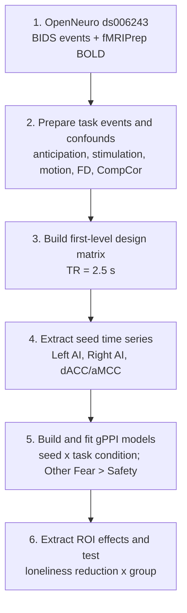

# Brain Connectivity During Observed Fear Anticipation and Loneliness Reduction After Meditation Training

> **Can another researcher reproduce this fMRI analysis without asking for hidden scripts or undocumented preprocessing decisions?**

A reproducible gPPI reanalysis of OpenNeuro `ds006243` comparing
Loving-Kindness Meditation (LKM) and Progressive Muscle Relaxation (PMR).

**Quick navigation:** [Background](#background) |
[Research question](#research-question) |
[Pipeline](#six-step-analysis-pipeline) |
[Pooled result](#1-no-simple-pooled-relationship-in-the-full-sample) |
[Pathway summary](#3-which-pathways-show-the-strongest-group-dependent-slopes) |
[Conclusion](#conclusion) |
[Discussion](#discussion) |
[Caveats](#exploratory-caveat)

## Background

One possible way to reduce loneliness is meditation. In particular,
loving-kindness meditation, or LKM, is designed to increase warm and positive
feelings toward oneself and others.


Loneliness may be related not only to how strongly individual brain regions
respond to social information, but also to how affective-empathy and
social-cognitive systems communicate during anticipation of another person's
pain.

The dataset contains an empathic-pain task collected after LKM or PMR
training. This project asks whether reductions in loneliness are related to
task-dependent functional connectivity, and whether that relationship differs
between the two training groups.

## Original Paper vs This Reanalysis

| Original study | This reanalysis |
| --- | --- |
| Self-other multi-voxel pattern similarity | Task-dependent functional connectivity |
| Are self and other neural patterns similar? | Do affective-empathy and social-cognitive regions communicate differently? |
| AI and dACC local pattern representation | AI/dACC-seeded connectivity with TPJ, STS, mPFC, and PCC |
| Loneliness and pattern similarity | Loneliness reduction x meditation group interaction |

## Research Question


> **Does reduced loneliness follow one shared neural relationship across
> everyone, or does the connectivity-loneliness relationship differ between
> LKM and PMR?**

The primary public contrast is **Other Fear Anticipation > Other Safety**.
Loneliness reduction is defined as `T1 - T2`, so positive values indicate
decreased loneliness after training.

## Six-Step Analysis Pipeline



The final inferential step tests whether the relationship between loneliness
reduction and connectivity differs between LKM and PMR in the full sample.

gPPI estimates task-dependent functional connectivity. “Left AI-seeded
connectivity with Right STS” describes the seed used to estimate connectivity;
it does not imply causal influence.

**No raw BOLD data, NIfTI maps, masks, or participant-level derivatives are
committed to this repository.**

## Results

The public results first examine whether loneliness reduction is related to a
simple pooled connectivity measure across all 54 participants. We then test
whether this relationship differs between LKM and PMR.

- **Full sample:** N = 54
- **LKM:** n = 29
- **PMR:** n = 25
- **Contrast:** Other Fear Anticipation > Other Safety
- **Status:** All reported findings are exploratory.

### 1. No Simple Pooled Relationship in the Full Sample


Across all 54 participants, loneliness reduction was not associated with the
AI mentalizing composite:

- **Spearman rho:** -0.098
- **p:** .480
- **Model q:** .236

This suggests that a single pooled brain-behavior relationship may not
adequately describe both meditation groups. This pooled null result motivates
testing whether the two meditation groups show different brain-behavior
slopes.

### 2. Why Test a Group Interaction?

> **If LKM and PMR show opposite brain-behavior slopes, pooling them may hide
> both patterns.**

```text
gPPI connectivity ~ loneliness reduction x group
```

- **gPPI connectivity:** task-dependent connectivity during **Other Fear
  Anticipation > Other Safety**.
- **Loneliness reduction:** `T1 - T2`; positive values indicate decreased
  loneliness.
- **Group:** LKM versus PMR.
- **Interaction:** tests whether the loneliness-connectivity slopes differ
  between groups.

We are not asking whether LKM had higher connectivity on average. We are
asking whether the connectivity-loneliness relationship had different slopes
in LKM and PMR.

### 3. Which Pathways Show the Strongest Group-Dependent Slopes?

Before interpreting individual scatter plots, we first examined the full set
of tested ROI pathways. The forest plot summarizes the estimated group
interaction effect for each pathway. Positive values indicate that the
loneliness reduction-connectivity slope was relatively more positive in LKM
than in PMR; confidence intervals crossing zero indicate no clear evidence of
a group slope difference.


The strongest positive interaction estimates were concentrated in Left
AI-seeded connectivity with Right STS and Right TPJ. Other tested pathways had
confidence intervals overlapping zero.

> **How to read this figure**
>
> - **Dot:** estimated group interaction beta.
> - **Horizontal line:** 95% confidence interval.
> - **Vertical zero line:** no difference in LKM and PMR slopes.
> - **Interval not crossing zero:** evidence for a slope difference.
>
> An interval crossing zero means there was no clear evidence of a group slope
> difference in the tested model, not proof of no effect.

### 4. Main Exploratory Pathway: Left AI-Seeded Right STS Connectivity

The forest plot identified Left AI-seeded Right STS connectivity as the
strongest positive group interaction estimate.


- **Interaction beta:** +1.414
- **p:** .005
- **FDR q:** .029
- **Contrast:** Other Fear Anticipation > Other Safety
- **Model:** Full-sample interaction, N = 54

The FDR-corrected interaction indicates that the relationship between
loneliness reduction and Left AI-seeded Right STS connectivity differed
between LKM and PMR.

In the fitted full-sample model, the LKM line was positive and the PMR line was
negative. These lines visualize the interaction; the statistical test is the
interaction term, not separate within-group correlations.

### 5. Related Exploratory Pathway: Left AI-Seeded Right TPJ Connectivity


- **Interaction beta:** +1.383
- **p:** .017
- **FDR q:** .050
- **Label:** FDR-threshold exploratory finding

Left AI-seeded Right TPJ connectivity showed a similar positive group
interaction estimate. Because the FDR q value was at the .05 threshold, this
finding should be interpreted cautiously.

Together, Right STS and Right TPJ suggest that the candidate effects were
concentrated in right-lateralized social-cognitive targets, rather than
reflecting a general increase across all tested pathways.

## Conclusion

This reanalysis did not identify a simple pooled association between
loneliness reduction and the AI mentalizing composite across all participants.
However, the full-sample group interaction analysis indicated that the
connectivity-loneliness relationship differed between LKM and PMR for two
candidate Left AI-seeded pathways: Right STS and, at the FDR threshold, Right
TPJ.

Conceptually, the findings are consistent with the possibility that changes
in loneliness after LKM may be related to task-dependent coupling between
affective-salience processing and social-cognitive processing during
anticipation of another person's possible pain.

The contribution of this repository is therefore twofold: it provides a
transparent gPPI workflow, and it identifies specific candidate pathways for
confirmatory follow-up.

**Take-home message**

1. A pooled null association can mask group-dependent brain-behavior
   relationships.
2. Left AI-seeded connectivity with Right STS was the strongest FDR-corrected
   exploratory interaction.
3. Reproducible code makes the full path from public data to group interaction
   test inspectable.

## Discussion

### What May This Mean?

Left AI is often associated with affective salience and
interoceptive-affective processing. Right STS and Right TPJ are commonly
implicated in social perception, mentalizing, and perspective-taking. The
observed pattern is therefore consistent with different links between
affective-empathy and social-cognitive systems in LKM and PMR.

### What Does This Not Mean?

- It does not establish that LKM caused the connectivity change.
- It does not establish that Left AI causally drives Right STS or Right TPJ.
- It does not show that LKM participants had higher connectivity overall.
- It does not prove that one intervention is superior to the other.
- It does not establish a clinical treatment mechanism.

### Key Limitations

- The highlighted ROI pairs were prioritized after preliminary inspection of
  the same dataset.
- FDR correction was applied within the tested interaction family, but it does
  not eliminate all researcher degrees of freedom.
- The results are correlational and do not establish mediation or causal
  direction.
- The sample size is modest for stable brain-behavior interaction estimates.
- Independent replication or preregistration is needed.

### Next Steps

1. Preregister Left AI-seeded Right STS as the primary replication pathway.
2. Treat Left AI-seeded Right TPJ as a secondary replication pathway.
3. Test whether baseline loneliness, motion, or other covariates alter the
   interaction.
4. Use an independent sample or held-out validation strategy.
5. Examine whether the connectivity pathway predicts behavioral empathy or
   social functioning outcomes.

## Exploratory Caveat

> **These findings are FDR-corrected within the tested interaction family, but
> they remain exploratory because the highlighted ROI pairs were prioritized
> after preliminary inspection of the same dataset. They are
> hypothesis-generating and require preregistered or independent replication.**
