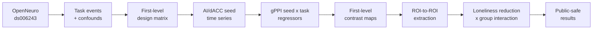

# Brain Connectivity During Observed Fear Anticipation and Loneliness Reduction After Meditation Training

> **Can another researcher reproduce this fMRI analysis without asking for hidden scripts or undocumented preprocessing decisions?**

A reproducible gPPI reanalysis of OpenNeuro `ds006243` comparing
Loving-Kindness Meditation (LKM) and Progressive Muscle Relaxation (PMR).

**Quick navigation:** [30-second overview](#30-second-overview) |
[Pipeline](#pipeline-at-a-glance) | [Main results](#primary-analytic-question-do-the-two-groups-show-different-brain-behavior-relationships) |
[Reproducibility](#reproducibility) | [5-minute presentation](docs/presentation_5min.md) |
[Live demo](docs/live_demo.md)

## 30-Second Overview

- **Original study:** self-other pattern similarity during empathic pain.
- **This project:** task-dependent functional connectivity between affective-empathy and social-cognitive systems.
- **Main exploratory finding:** group-dependent Left AI-seeded connectivity with Right STS and Right TPJ during **Other Fear Anticipation > Other Safety**.

## Question for the Audience

> **When loneliness decreases, does the brain become more empathic, or better connected?**

- **A.** Stronger self-other pattern similarity
- **B.** Stronger pain response
- **C.** Stronger communication between affective-empathy and social-cognitive systems

**This repository tests option C.**

## Original Paper vs This Reanalysis

| Original study | This reanalysis |
| --- | --- |
| Self-other multi-voxel pattern similarity | Task-dependent functional connectivity |
| Are self and other neural patterns similar? | Do affective-empathy and social-cognitive regions communicate differently? |
| AI and dACC local pattern representation | AI/dACC-seeded connectivity with TPJ, STS, mPFC, and PCC |
| Loneliness and pattern similarity | Loneliness reduction x meditation group interaction |

## Pipeline at a Glance



gPPI estimates task-dependent functional connectivity. A label such as
“Left AI-seeded connectivity with Right STS” describes the seed used to
estimate connectivity; it does **not** imply causal influence from one region
to another.

**No raw BOLD data, NIfTI maps, or participant-level derivatives are committed
to this repository.**

## Primary Analytic Question: Do the Two Groups Show Different Brain-Behavior Relationships?

Rather than asking whether LKM or PMR had higher connectivity on average, we
tested whether the relationship between loneliness reduction and connectivity
differed between the two groups.

```text
gPPI connectivity ~ loneliness reduction x group
```

- **gPPI connectivity:** task-dependent connectivity during **Other Fear
  Anticipation > Other Safety**.
- **Loneliness reduction:** `T1 - T2`; positive values indicate decreased
  loneliness after training.
- **Group:** LKM or PMR.
- **Interaction:** whether the LKM and PMR regression slopes differ.

**The analysis used the full sample of 54 participants, including 29 LKM and
25 PMR participants.**

## Main Full-Sample Result: Left AI-Seeded Connectivity with Right STS


*Full-sample group interaction analysis (N = 54). Points are individual
participants; colors and marker shapes indicate meditation group. Separate
fitted lines visualize the group-by-loneliness reduction interaction.*

- **Contrast:** Other Fear Anticipation > Other Safety
- **Model:** gPPI effect ~ loneliness reduction x group
- **Interaction beta:** +1.414
- **p:** .005
- **FDR q:** .029

The groups showed different connectivity-loneliness reduction slopes. The
significant interaction means that the slope linking loneliness reduction to
Left AI-seeded Right STS connectivity differed between LKM and PMR. It does
not mean that one group had uniformly higher connectivity.

## How to Interpret the Two Regression Lines

The LKM line has a positive fitted slope, while the PMR line has a negative
fitted slope. These lines are shown to explain the interaction. **The
inferential test is the interaction term in the full-sample regression model,
not separate within-group correlations.**

```text
Full sample N=54
        |
Test: loneliness reduction x group
        |
Significant slope difference
        |
LKM: positive fitted slope
PMR: negative fitted slope
```

A visible difference between two lines is not sufficient by itself. The
statistical evidence comes from the interaction beta and its corrected p value.

For a fuller explanation, see
[Understanding the group interaction](docs/group_interaction_explained.md).

## Second Full-Sample Interaction Result: Left AI-Seeded Connectivity with Right TPJ


- **Interaction beta:** +1.383
- **p:** .017
- **FDR q:** .050
- **Label:** FDR-threshold exploratory finding

A similar but threshold-level interaction was observed for Left AI-seeded
connectivity with Right TPJ.

## Summary Forest Plot


The forest plot shows that the strongest positive group interaction estimates
were concentrated in Left AI-seeded connectivity with Right STS and Right TPJ;
other tested connections had confidence intervals overlapping zero.

All figures above are public-safe versions without participant labels. See the
[figure guide](docs/figures/README.md) and
[public result tables](results/README.md).

## Neurocognitive Interpretation

Left AI is commonly linked to affective salience and
interoceptive-affective processing. Right STS and Right TPJ are commonly
associated with social perception, mentalizing, and perspective-taking. The
observed group interaction is therefore consistent with different links
between affective-empathy and social-cognitive systems after LKM versus PMR.

This interpretation concerns Left AI-seeded connectivity with Right STS/TPJ.
It does not establish causal direction or prove a neural mechanism of LKM.

## Exploratory Caveat

> **These were full-sample, FDR-corrected group interaction results within the
> tested interaction family. However, because the highlighted ROI pairs were
> prioritized after preliminary inspection of the same dataset, they should
> be interpreted as exploratory and hypothesis-generating rather than
> confirmatory. Independent or preregistered replication is needed.**

## Reproducibility

**`docs/`**

Research question, ROI definitions, data sources, and analysis rationale.

**`scripts/`**

Step-by-step runnable analysis commands.

**`src/lkm_connectivity/`**

Reusable Python functions for events, confounds, GLM, gPPI, and group models.

**`tests/`**

Synthetic tests that validate analysis logic without requiring real fMRI data.

Start here:

- [Run the pipeline](docs/running_pipeline.md)
- [Understand the ROI-to-ROI analysis](docs/roi_to_roi_analysis.md)
- [Prepare seed and target masks](docs/seed_masks.md)
- [Reproduce and audit the workflow](docs/reproducibility.md)

## Repository Layout

```text
docs/                 research decisions, presentation, and running guides
results/              small public-safe summary tables and figures
scripts/              command-line entry points for each pipeline stage
src/lkm_connectivity/ reusable analysis functions
tests/                synthetic validation without private or imaging data
README.md             research story and navigation
environment.yml       reproducible Conda environment
requirements.txt      Python package requirements
.gitignore            safeguards against committing imaging data and outputs
```

## Discussion Prompt

> **If you were preregistering the next study, would you select Left AI-Right
> STS, Left AI-Right TPJ, or both as the primary pathway? Why?**
